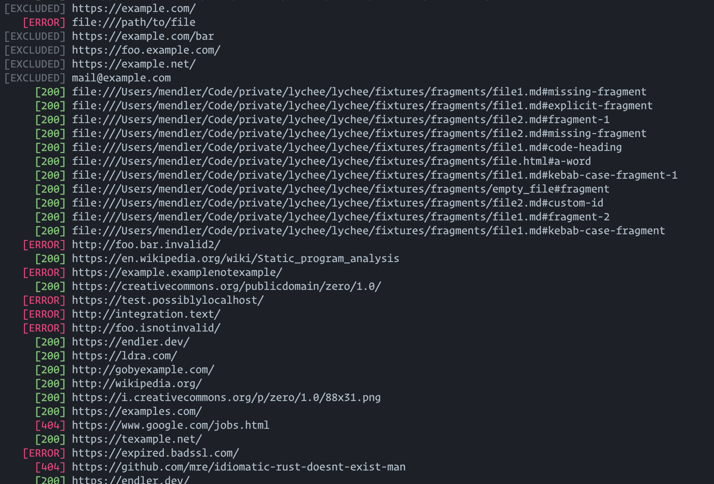
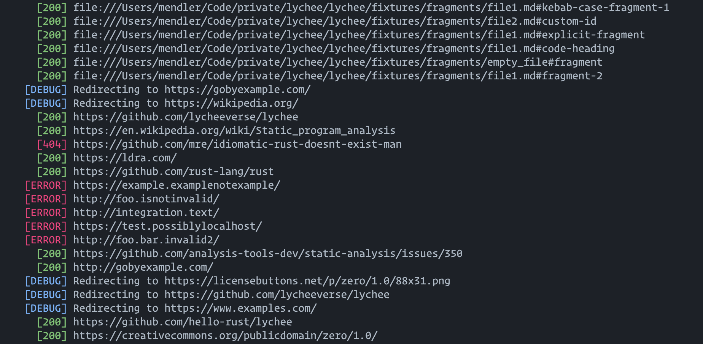
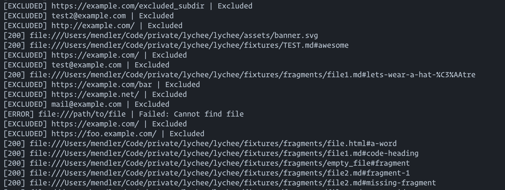

lychee supports a number of output formats for displaying the results of a check.
You can specify the output format using the `--mode` flag.

At the moment, lychee supports the following output modes:

- `color`: Color, indented formatting (default)
- `plain`: No color, basic formatting
- `emoji`: Fancy mode with emoji icons

Let's take a closer look at each one.

## Color Mode

Color mode is the default output mode. It displays the results in a color-coded format, making it easy to distinguish between different types of links.

### `--mode color`

### `--mode color -vv` (verbose debug output)

## Plain Mode

Plain mode displays the results in a simple, easy-to-read format. It is useful for automated scripts or when you want to save the output to a file.

## Emoji Mode

Emoji mode displays the results using emojis. It is a fun and engaging way to view the results of a check.

